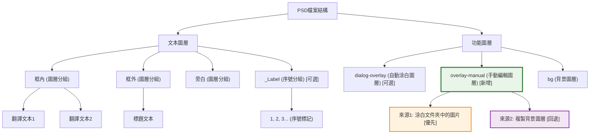

# LabelPlus PS-Script


## 🆕 新增功能：涂白文件夾 (overlay-manual)

### 功能特點
- **智能圖層管理**：新增 `overlay-manual` 圖層，用於手動編輯和背景處理
- **涂白文件夾支援**：可指定專門存放預處理圖片的文件夾
- **智能文件匹配**：支援不同後綴名匹配（如 `page01.png` 可匹配 `page01.jpg`）
- **自動回退機制**：找不到涂白圖片時自動使用背景圖層內容

### 使用方式
1. 在UI的"輸入"面板中設定**涂白文件夾**路徑（可選）
2. 在涂白文件夾中放置與原圖同名的預處理圖片
3. 執行導入，系統會自動使用涂白圖片作為 `overlay-manual` 圖層

### 適用場景
- 複雜背景需要手動預處理
- 自動涂白效果不理想時的補充方案
- 批量處理已預先涂白的圖片
- 對背景處理品質有特殊要求的專業翻譯

### 圖層結構



---

## 概述

LabelPlus是一个用于图片翻译的工具包，本工程是其中的Photoshop文本导入工具，它读入翻译文本，并将文本逐条添加到PSD档中。

脚本用到的开源项目：
* [xtools(BSD license)](http://ps-scripts.sourceforge.net/xtools.html)中部分工具函数及UI框架
* [JSON Action Manager](http://www.tonton-pixel.com/json-photoshop-scripting/json-action-manager/index.html)中的JSON解析库

功能一览：

* 解析LabelPlus文本 创建对应文本图层
* 允许选择性导入部分文件、分组
* 允许更换图源：可使用不同尺寸、可根据顺序自动匹配文件名（图片顺序、数量必须相同）、可替换图源后缀名
* **🆕 涂白文件夹支援**：可指定涂白文件夹，自動載入預處理圖片到overlay-manual圖層
* **🆕 智能文件匹配**：支援不同後綴名的文件匹配（如.png匹配.jpg）
* 自定义自动替换文本规则（如自动将`！？`替换为`!?`）
* 格式设置：字体、字号、行距、文本方向
* 可设置自定义动作：每导入一段文字后，执行动作；打开、关闭文档时执行动作
* 根据标号位置自动涂白（实验功能）

## 开发方法

### requirement
* typescript
* python

```
$ sudo apt install python nodejs
$ sudo npm install -g typescript yarn
$ npm config set registry https://registry.npmmirror.com
$ yarn config set registry https://registry.npmmirror.com
```

### build

```
$ cd PS-Script
$ yarn install
$ ./build.sh
```

建置完成後，會在 `build/` 目錄生成 `LabelPlus_Ps_Script_ZS.jsx` 腳本文件，可直接在 Photoshop 中使用。
